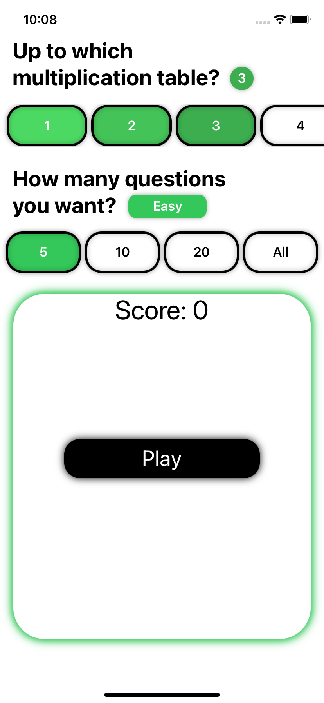
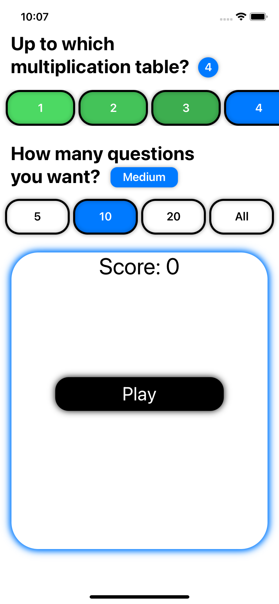
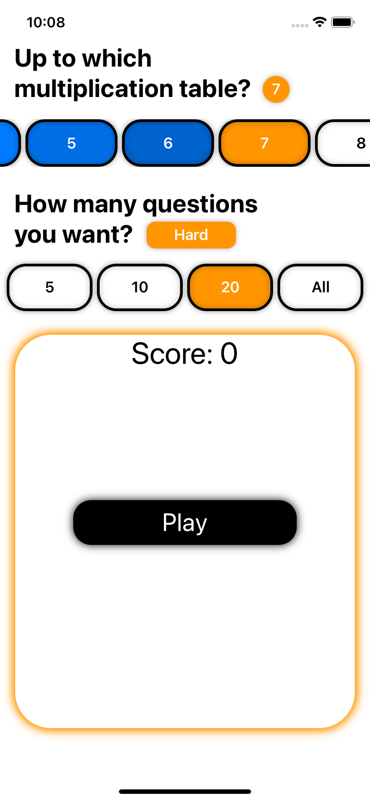
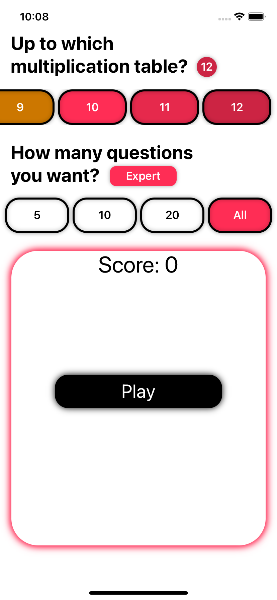

# Multiplication Table App
MultiplicattionTable is a SwiftUI app which aims to help practicing the multiplication tables, from 1 to 12. You can choose from any of them, as well as the number of questions, from 5 to all the possible, depending on the table. The UI adapts to the difficulty selected, there is also a custom number pad and is smart on knowing if an aswer requires 1, 2 or even 3 digits.

## Screenshots & Demo

| Easy | Medium | Hard | Expert | Demo |
| --- | --- | --- | --- | --- |
| 
| 
| 
| 
|  |
